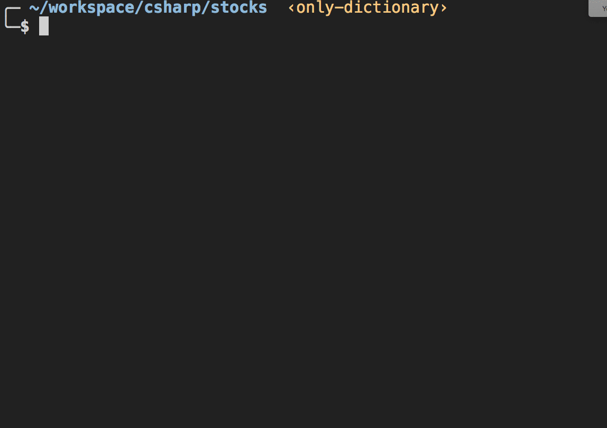

# Common Types - Dictionary

In C#, a **`Dictionary`** is much like the objects that you used in JavaScript. They are collections of a key/value pairs - just strongly typed.

Here's a JavaScript object to represent toys sold by a business.

```js
const toysSold = {
    "hotWheels": 344,
    "legos": 763,
    "gamingConsoles": 551,
    "boardGames": 298
}
```

Here's how that would look in C# as a **`Dictionary`**.

```cs
Dictionary<string, int> toysSold = new Dictionary<string, int>() {
    {"Hot Wheels", 344},
    {"Legos", 763},
    {"Gaming Consoles", 551},
    {"Board Games", 298}
};
```

You can also use the `Add()` method to add more key/value pairs to a dictionary.

```cs
toysSold.Add("Bicycles", 87);
```

## Iterating a Dictionary

If you want to see all the toys and how many were sold, you can use a `foreach` to iterate over all of the `KeyValuePair` items in the dictionary.

```cs
foreach(KeyValuePair<string, int> toy in toysSold)
{
    Console.WriteLine($"We sold {toy.Value} units of {toy.Key}");
}
```

# Practice: Stock Purchase Dictionaries

## Setup

```
mkdir -p ~/workspace/csharp/exercises/dictionaries && cd $_
dotnet new console
```

## References

* [C# dictionaries](https://msdn.microsoft.com/en-us/library/xfhwa508(v=vs.110).aspx#Anchor_8)
* [Dictionary in C#](http://www.c-sharpcorner.com/UploadFile/219d4d/dictionary-in-C-Sharp-language/)
* [Interactive C# Dictionaries](http://www.learncs.org/en/Dictionaries)

## Instructions

A block of publicly traded stock has a variety of attributes, we'll look at a few of them. A stock has a ticker symbol and a company name. Create a simple dictionary with ticker symbols and company names in the `Main` method.

##### Example

```cs
Dictionary<string, string> stocks = new Dictionary<string, string>();
stocks.Add("GM", "General Motors");
stocks.Add("CAT", "Caterpillar");
// Add a few more of your favorite stocks
```

To find a value in a Dictionary, you can use square bracket notation much like JavaScript object key lookups.

```cs
string GM = stocks["GM"];   <--- "General Motors"
```

Next, create a list to hold stock purchases by an investor. The list will contain dictionaries.

```cs
List<Dictionary<string, double>> purchases = new List<Dictionary<string, double>>();
```

Then add some purchases.

##### Example

```cs
purchases.Add (new Dictionary<string, double>(){ {"GE", 230.21} });
purchases.Add (new Dictionary<string, double>(){ {"GE", 580.98} });
purchases.Add (new Dictionary<string, double>(){ {"GE", 406.34} });

// Add more purchases for each stock
```

Create a total ownership report that computes the total value of each stock that you have purchased. This is the basic relational database join algorithm between two tables.



> **Helpful Links:** [ContainsKey](https://msdn.microsoft.com/en-us/library/kw5aaea4(v=vs.110).aspx), [Add](https://msdn.microsoft.com/en-us/library/k7z0zy8k(v=vs.110).aspx)

```cs
/*
    Define a new Dictionary to hold the aggregated purchase information.
    - The key should be a string that is the full company name.
    - The value will be the total valuation of each stock


    From the three purchases above, one of the entries
    in this new dictionary will be...
        {"General Electric", 1217.53}

    Replace the questions marks below with the correct types.
*/
Dictionary<?, ?> stockReport = new Dictionary<?, ?>();

/*
   Iterate over the purchases and record the valuation
   for each stock.
*/
foreach (Dictionary<string, double> purchase in purchases)
{
    foreach (KeyValuePair<string, double> stock in purchase)
    {
        // Does the full company name key already exist in the `stockReport`?

        // If it does, update the total valuation

        /*
            If not, add the new key and set its value.
            You have the value of "GE", so how can you look
            the value of "GE" in the `stocks` dictionary
            to get the value of "General Electric"?
        */
    }
}
```

Now that the report dictionary is populated, display the final results.

```cs
foreach(KeyValuePair<?, ?> item in stockReport)
{
    Console.WriteLine($"The position in {display the key} is worth {display the value}");
}
```
---
# Practice: Iterating over planets

Now we'll combine Dictionaries with the Lists we learned in the [previous chapter](./DATA_STRUCTURES_LIST.md).

## Instructions
> **Ref:** [List of Solar System probes](https://en.wikipedia.org/wiki/List_of_Solar_System_probes)

1. Use the list of planets you created in the previous chapter or create a new one with all eight planets.
    ```cs
    List<string> planetList = new List<string>(){"Mercury", "Venus", "Earth", ...};
    ```

1. Create another list containing dictionaries. Each dictionary will hold the name of a spacecraft that we have launched, and the name of a planet that it has visited. The key of the dictionary will be the planet name, and the value will be the spacecraft.
    ```cs
    List<Dictionary<string, string>> planetProbes = new List<Dictionary<string, string>>();
    ```

    This would be the equivalent of an having an array of objects in JavaScript.

    ```js
    const planetProbes = [
        {
            "Mars": "Viking 1"
        },
        {
            "Venus": "Mariner 1"
        },
        {
            "Mars": "Viking 2"
        }
    ]
    ```
1. Iterate over `planetList`, and inside that loop, iterate over the list of dictionaries. Write to the console, for each planet, which satellites have visited which planet.
    ```cs
    // iterate planets
    foreach (string planet in planetList)
    {
        List<string> matchingProbes = new List<string>();

        foreach() // iterate planetProbes
        {
            /*
                Does the current Dictionary contain the key of
                the current planet? Investigate the ContainsKey()
                method on a Dictionary.

                If so, add the current spacecraft to `matchingProbes`.
            */
        }

        /*
            Use String.Join(",", matchingProbes) as part of the
            solution to get the output below. It's the C# way of
            writing `array.join(",")` in JavaScript.
        */
        Console.WriteLine($"{}: {}");
    }
    ```

#### Example Output in the Terminal

```sh
Mars: Viking, Opportunity, Curiosity
Venus: Mariner, Venera
```
