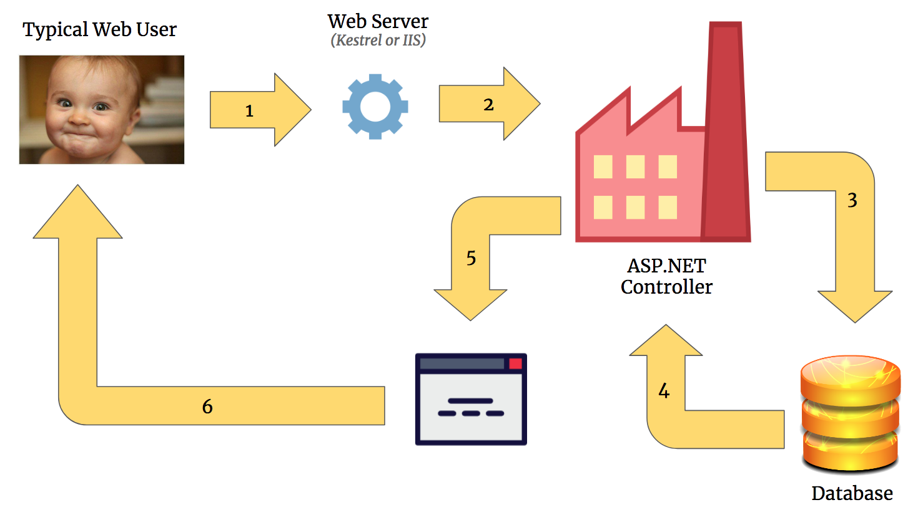

# Models and Controllers

First, models are just classes.

Second, these model classes are intended to be a C# representation of a database table.

Here's what your student table definition is.

```sql
CREATE TABLE Student (
    Id	integer NOT NULL PRIMARY KEY IDENTITY,
    FirstName	varchar(80) NOT NULL,
    LastName	varchar(80) NOT NULL,
    SlackHandle	varchar(80) NOT NULL,
    CohortId	integer NOT NULL,
    CONSTRAINT FK_StudentCohort FOREIGN KEY(CohortId) REFERENCES Cohort(Id)
);
```

That table stores the raw data for students. When you query the database for a student, you want to represent that data as an object in your code. Below is the most basic representation of that database table as a class.

Note that the `[Required]` attribute is on each property because each of those columns in the database are marked as `NOT NULL` - meaning that blank values cannot be stored in them. You need to mimic that in your data model class.

```cs
using System.Collections.Generic;
using System.ComponentModel;
using System.ComponentModel.DataAnnotations;

namespace StudentExercises.Models
{
    public class Student
    {
        [Required]
        public int Id { get; set; }

        [Required]
        public string FirstName { get; set; }

        [Required]
        public string LastName { get; set; }

        [Required]
        public string SlackHandle { get; set; }

        [Required]
        public int CohortId { get; set; }
    }
}
```

## Additional Properties not Mapped to Columns

When a `Student` instance gets created, you can access the `FirstName` and `LastName` properties and concatendate them together. However, if this happens many times in your application, you can save time, and code, by creating a computed property called `FullName`.

This property is not saved in the database, but is used by your application logic.


```cs
public string FullName {
    get {
        return $"{FirstName} {LastName}";
    }
}
```

## Controllers

First, controllers are just classes.

Second, these classes have methods to handle HTTP requests to your application.

The controller has all of the logic needed to generate the  response requested by the client. It can validate the user, validate request data, query the database, logic for manipulating the data, and generating an HTML response.

Here is the overall workflow.

1. Client generates a request
1. Request is heard by a web server and passed along to your application
1. The appropriate controller method code begins executing
1. Data is requested from the database
1. Data is received from database
1. Data is used to dynamically build an HTML document
1. HTML document is then sent back as the response to the original request by the client


